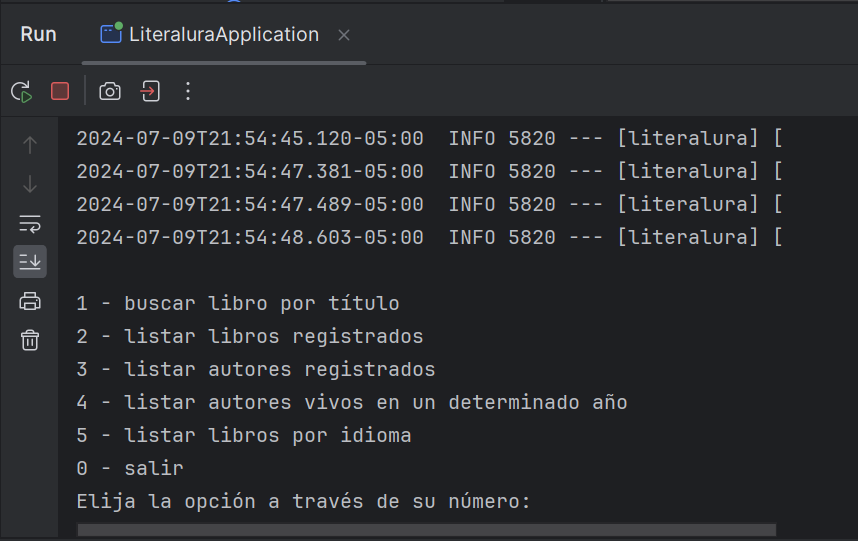
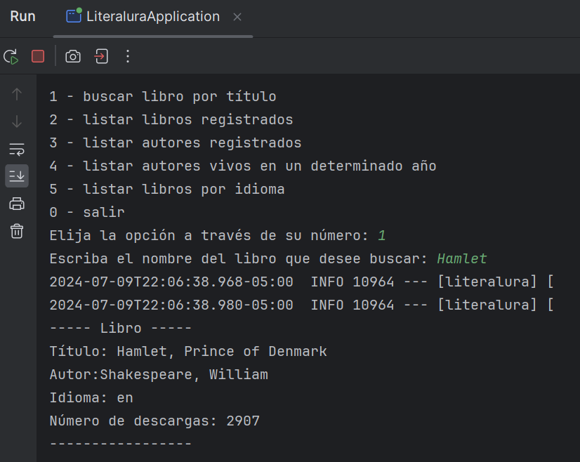
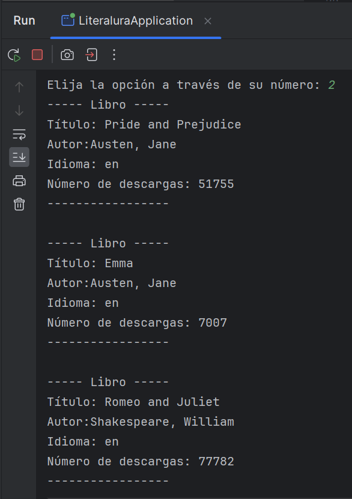
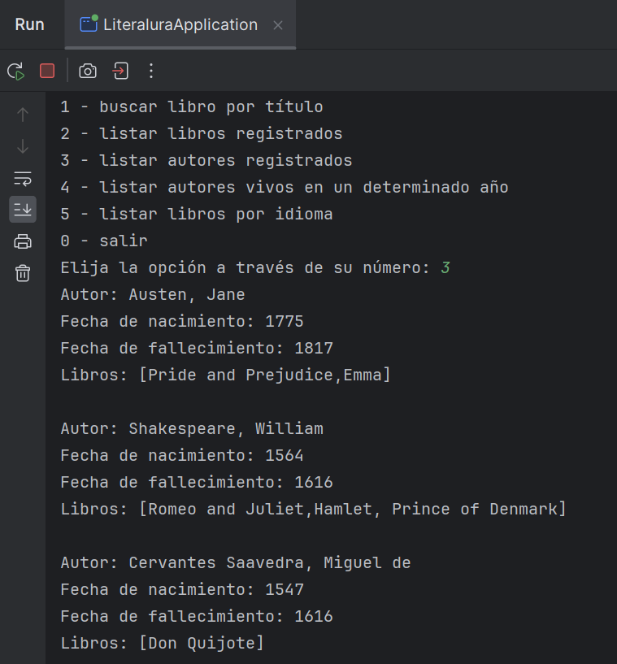
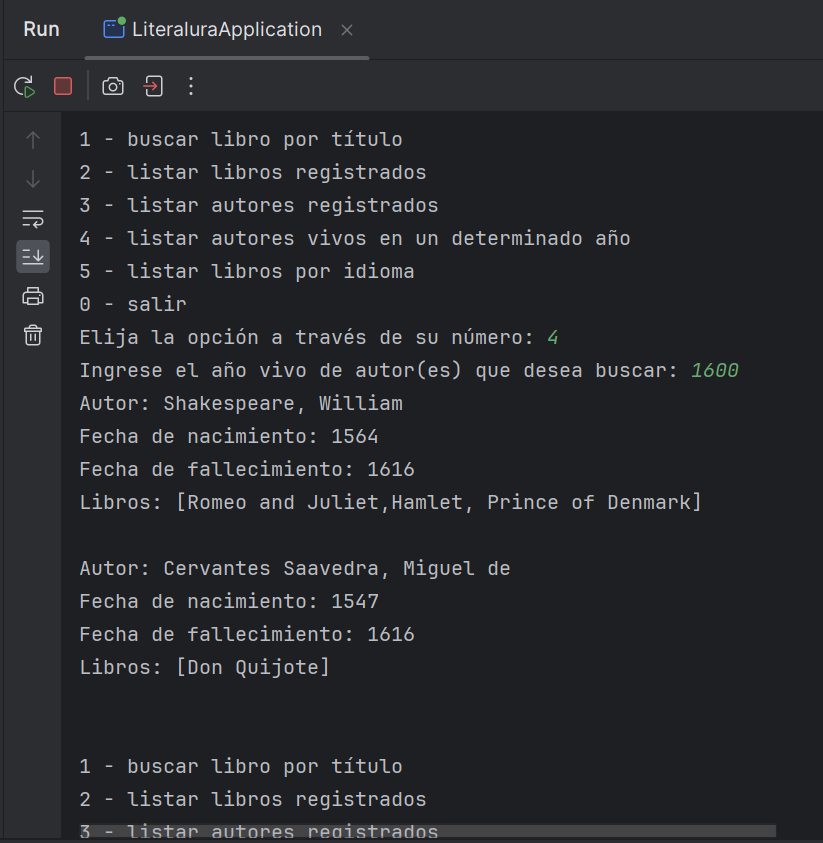
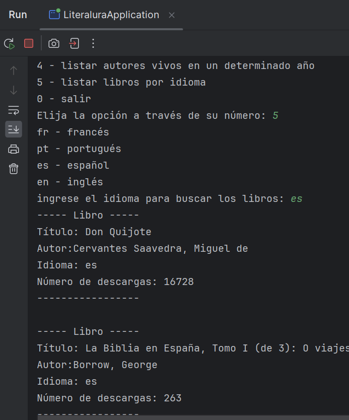

# LiteraLura
Se propone solución del desafío Spring Boot: Challenge Literalura del curso de Alura y Microsoft One para desarrollar un catálogo de libros que ofrezca interacción textual vía consola con los usuarios. Se realizará consumo de una API, análisis de respuesta JSON, interacción con el motor de base de datos MYSQL y exhibición de los resultados a los usuarios vía consola de comandos.

Al ejecutar la aplicación, se visualizará el siguiente menú: 

En la siguiente imagen, aprecié como busca un libro por su nombre, y lo almacena en la BD. Se realiza las respectivas validaciones para no almacenar un mismo libro dos veces.

En la siguiente imagen, se aprecia la funcionalidad de listar todos los libros registrados en la BD.

En la siguiente imagem, se evidencia la funcionalidad de listar todos los autores registrados. En el apartado de libros, se visualizan los libros correspondientes al autor.

Se ilustra la funcionalidad de buscar los autores vivos en un determinado año.

Por último, en la siguiente figura se muestra la funcionalidad de buscar los libros por el idioma especificado. Se controla que no se ingrese un idioma no disponible.
